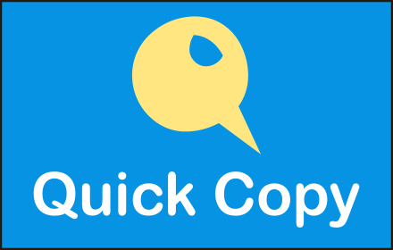

# Quick Copy chrome extension overview

Quickly copy configured text to clipboard with two clicks. Sync configured text across devices.


#### [Chrome webstore link](https://chrome.google.com/webstore/detail/quick-copy/llemocbeniphffbfjifkpkdkheicomdf)

#### [Microsoft Edge Add-ons link](https://microsoftedge.microsoft.com/addons/detail/quick-copy/giodfegjpbcahiaegpmccclhgolnpldc) 

&nbsp;

# Configuring and running the project

## Installation
1. Install [Node.js](https://nodejs.org/en/download/)
2. Clone this repository
3. Run `npm install` from root directory of the project

&nbsp;
## Running the extension on chrome (or edge) in developer mode
1. Build the project using following command from root directory  
`npm run-script build-no-embed-script`
2. A `build` directory will be created at root of project. 
3. Follow the instructions at this [link](https://webkul.com/blog/how-to-install-the-unpacked-extension-in-chrome/) and load the `build` directory as extension 

&nbsp;

## Running on web browser (not as extension)
If you need to test out just UI and not storage/retrieval of data then you can run this as SPA on browser and not as extension. This is very helpful since you don't need to build and load the extension in the browser everytime after small change. 

To do this you need to:
1. Comment out the code related to storage & retrieval of data in `App.js` file. Comment out all the lines with `window.chrome.storage.sync`. I have comments in the `App.js` file to indicate this. 
2. Uncomment below line in `App.js` to load the test data  
    ```javascript
    //const[userList, setUserList] = useState(testData);
    ```
3. Run `npm start` from root directory and it will open up the browser window with test data. 

&nbsp;

# Contribution
Check out [Issues](https://github.com/somared/QuickCopyChromeExt/issues) on Github of this project and send pull request for bug fix or enhancement.